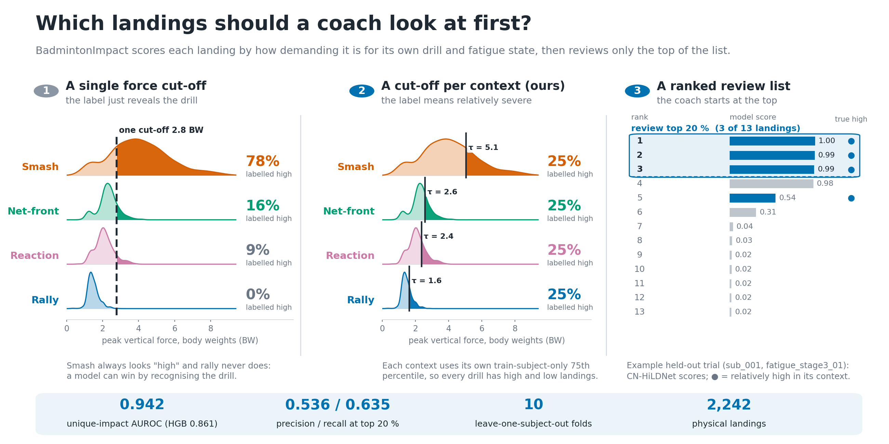
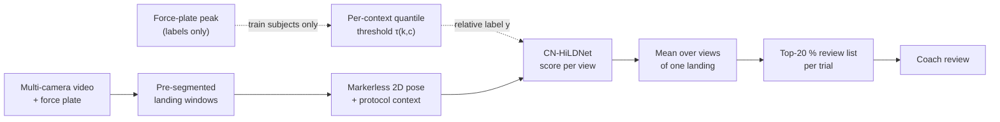
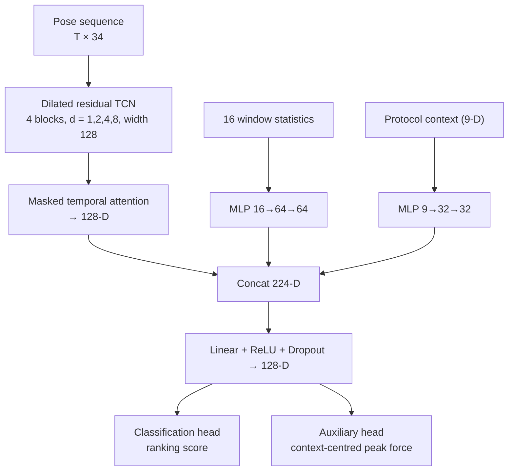
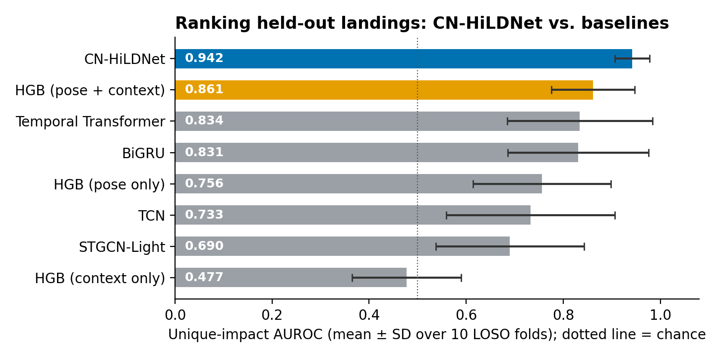
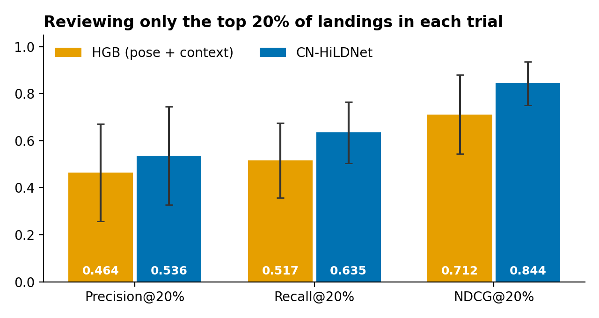
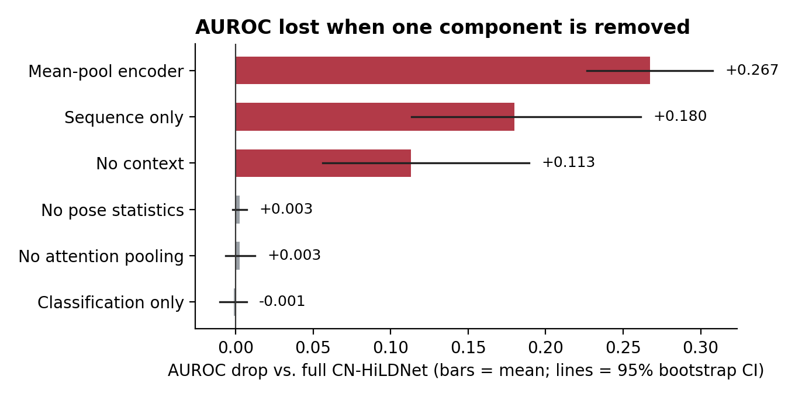

<h1 align="center">BadmintonImpact</h1>
<p align="center"><b>Context-relative ranking of badminton landing events from markerless pose</b><br>
<sub>Code for the paper in <i>IET Cyber-Systems and Robotics</i> (2026)</sub></p>

<p align="center">
  <a href="https://www.python.org/downloads/"></a>
  <a href="LICENSE"></a>
  
  
</p>

<p align="center">
  
</p>

---

## At a glance

A training centre records many hours of multi-camera badminton video; a coach cannot inspect every landing. **BadmintonImpact** ranks *already identified* landing events by how demanding they are **relative to their own movement-and-fatigue context**, using only markerless 2D pose, so that a limited review budget (e.g. the top 20 % of each trial) goes to the most relevant clips.

| | |
|---|---|
| **Input** | A pre-segmented, impact-centred pose window (±0.5 s, COCO-17), 16 window statistics, protocol context (drill, fresh/fatigued) |
| **Output** | One relative-priority score per landing; duplicate camera views are merged into one score per physical landing |
| **Supervision** | Force-plate peaks, used **only** to build labels (never an input at inference) |
| **Evaluation** | Leave-one-subject-out (LOSO), unique-impact AUROC/AUPRC/F1, fixed Top-20 % review budget, calibration |

### What this repository does *not* claim

This is a scoring module for pre-segmented windows. It does **not** detect landings in continuous video, estimate absolute ground-reaction force, assess injury risk, or coach autonomously. The exact claim boundary is frozen in [`docs/RESEARCH_CONTRACT.md`](docs/RESEARCH_CONTRACT.md).

---

## The idea in one figure



**Why context-relative labels?** One global force cut-off lets the drill identity predict the label (a smash always looks "high"). Instead, for each LOSO fold *k* and each stage–fatigue context *c*, the threshold uses **training subjects only**:

$$
\tau_{k,c} = Q_{q}\left(\{\,p_i : s_i \in \mathcal{S}^{(k)}_{\text{train}},\ \boldsymbol{c}_i = c\,\}\right), \qquad q = 0.75,
\qquad
y_i = \mathbb{1}[\,p_i \ge \tau_{k,c_i}\,]
$$

so "high impact" means *high for that drill and fatigue state*, and the held-out athlete never touches a threshold. A context-only model scores near chance (AUROC 0.477), showing the labels no longer leak the protocol.

---

## CN-HiLDNet

A small, task-specific model with three parallel branches fused before two heads. It is an *implementation of the formulation*, not a claim that every part is necessary (see the ablation below).



Only the classification score is used for ranking at inference. The model has 451,043 trainable parameters.

---

## Results

Ten LOSO folds, 2,242 physical landings (17,267 camera views), one cohort and venue. Unique-impact (one score per physical landing) is the primary resolution.

<p align="center"></p>

| Primary endpoint (unique-impact AUROC) | CN-HiLDNet | HGB (pose + context) | Paired difference |
|---|---|---|---|
| mean ± SD over folds | **0.942 ± 0.036** | 0.861 ± 0.086 | **0.081** (8.1 percentage points; 95 % CI 0.039–0.132; exact Wilcoxon *p* = 0.00195; positive in all 10 folds) |

### A fixed review budget

Reviewing only the top 20 % of candidate landings in each held-out trial:

<p align="center"></p>

### What the ablation does — and does not — support

<p align="center"></p>

Temporal encoding and context conditioning are supported. **Pose statistics, learned attention pooling and the auxiliary regression head show no independent benefit** in this experiment (their intervals include zero), so the full model should be read as the evaluated implementation, not as proof that each part is needed.

### Honest limitations

- The advantage is concentrated in **structured drills**; on **rally** footage a distinct benefit is *not* demonstrated (unique-impact AUROC difference 0.011, 95 % CI −0.142 to 0.219).
- 10 participants, one venue; LOSO cannot establish generalisation across cameras, clubs or protocols.
- One deterministic seed per fit; fold SDs mix participant and training variation.
- Results are for aligned, pre-segmented windows, not an end-to-end video system.

---

## Quick start

```bash
git clone https://github.com/KenyaNiu/BadmintonImpact.git && cd BadmintonImpact
python3 -m venv .venv && source .venv/bin/activate
pip install -e ".[dev,train]"        # Python ≥ 3.10; install a CUDA/CPU build of torch if needed
pytest -q                            # 25 tests, synthetic data only
```

The CLI has four stages:

| Command | Purpose |
|---|---|
| `badminton-impact prepare` | Build base labels, context labels and pose features from the BadmintonGRF Tier-1 data |
| `badminton-impact run` | Train and evaluate all models under LOSO (`--check-only` validates without training; `--resume` continues) |
| `badminton-impact analyze` | Fold metrics, Top-K review metrics, calibration, rally subgroups, paired statistics |
| `badminton-impact artifacts` | Write paper-facing tables and the numbers used in the article |

```bash
cp configs/preparation.example.yaml configs/preparation.local.yaml   # set data_root
badminton-impact prepare --config configs/preparation.local.yaml

# smoke run (minutes) before the full experiment
badminton-impact run     --config configs/experiments/smoke.yaml --run-dir outputs/runs/smoke
badminton-impact analyze --run-dir outputs/runs/smoke

# full canonical run
badminton-impact run     --config configs/experiments/main.yaml --run-dir outputs/runs/corrected_q75 --resume
badminton-impact analyze --run-dir outputs/runs/corrected_q75
```

Every run directory records the resolved configuration, input hashes, environment, cohort, splits, predictions, metrics, checkpoints and completion state. Acceptance gates are listed in [`docs/REPRODUCTION.md`](docs/REPRODUCTION.md). The README figures are regenerated with `python3 docs/assets/make_hero.py --prepared outputs/prepared --run-dir outputs/runs/corrected_q75` (header figure) and `python3 docs/assets/make_readme_figures.py --run-dir outputs/runs/corrected_q75` (result charts).

---

## Repository layout

```text
BadmintonImpact/
├── badminton_impact_ai/   # package and the single CLI
│   ├── data/              # NPZ parsing, label construction, cohort rules, splits, datasets
│   ├── models/            # CN-HiLDNet and comparison backbones (TCN, BiGRU, Transformer, STGCN-Light)
│   ├── experiment/        # config, training, run provenance, analysis, paper artifacts
│   ├── metrics/           # classification, ranking (Top-K), calibration, regression
│   └── stats/             # fold-level paired comparisons (bootstrap CI, Wilcoxon)
├── configs/               # preparation template and frozen experiment YAML
├── docs/                  # research contract, reproduction guide, data-access form, figures
├── paper/figures/         # script that regenerates the result figures
└── tests/                 # unit and synthetic end-to-end tests
```

---

## Data access

The BadmintonGRF data products are shared through a **controlled request process** and are not included here. Complete [`docs/BadmintonImpact_data_access_request_form.md`](docs/BadmintonImpact_data_access_request_form.md) and email it to the address given in the form. Eligible, approved applicants receive the de-identified package needed to reproduce the analyses; recipients may not attempt re-identification or redistribution.

---

## Citation

```bibtex
@article{niu2026badmintonimpact,
  title   = {{BadmintonImpact}: Context-Relative Ranking of Pre-Segmented Badminton Landing Events from Markerless Pose for Coach Review},
  author  = {Niu, Kuoye and Song, Xian and Xie, Yilun and Sun, Jia'ao and Yang, Lumeng and Wan, Puyang and Ding, Ziran and Ma, Yong and Li, Jianwei},
  journal = {IET Cyber-Systems and Robotics},
  year    = {2026},
  note    = {Accepted; volume, pages and DOI to be added on publication}
}
```

The code release corresponding to the article is tagged [`v1.0-csr-2026`](../../releases/tag/v1.0-csr-2026).

## Contact and license

Questions about the code: open an issue. Data requests: see above. Code is released under the [MIT License](LICENSE); dataset files keep the terms of their original release.
