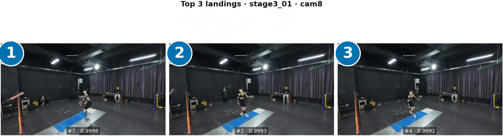

# BadmintonImpact

[](https://www.python.org/downloads/)
[](LICENSE)

Markerless 2D pose → landing-impact scores on **BadmintonGRF Tier&nbsp;1** windows; training is **LOSO**, inference uses **pre-segmented** clips only.

<p align="center">
  
</p>

---

## Setup

**Stack:** Linux x86_64, Python **3.10**, GPU optional for deep LOSO (CPU OK for HGB). Tier&nbsp;1 data is read-only; paths are passed on the CLI.

**Conda** (`environment.yml`; env name `badminton_grf`):

```bash
conda env create -f environment.yml
conda activate badminton_grf
pip install -e ".[dev,train]"
```

Refresh env after editing `environment.yml`:

```bash
conda env update -f environment.yml --prune
```

**venv + pip:**

```bash
python3.10 -m venv .venv && source .venv/bin/activate   # Windows: .venv\Scripts\activate
pip install -U pip && pip install -e ".[dev,train]"
pip install torch torchvision   # pick CUDA/CPU: https://pytorch.org/get-started/locally/
```

---

## Usage

Run from the **repository root** with **`python3`** (matches `environment.yml`). Point **`--data-root`** at the Tier‑1 tree (defaults to `data/BadmintonGRF-data`). Prefer **one symlink to the dataset root** — nested “fake trees” made only from per-subject symlinks may not be traversed the same way by the walker in step **1**.

Step **1** must see **multiple subjects** under `--data-root`; if only one subject is scanned, step **2** can fail (empty LOSO train stats).

**Rough runtime** on a full Tier‑1 mirror (~18k NPZ files on this repo’s reference machine): step **1** ~10–20 s, step **2** ~1–2 s, step **3** ~2–3 min (NPZ IO bound). Training time depends on folds and GPU.

```bash
mkdir -p outputs

ln -sf /path/to/BadmintonGRF/data data/BadmintonGRF-data    # optional; fixes default --data-root

# 1) Contact-state labels
python3 tools/extract_contact_labels_full.py \
  --out-csv outputs/contact_labels.csv \
  --out-audit outputs/contact_labels_audit.json

# 2) LOSO context-normalized labels
python3 tools/build_context_labels.py \
  --labels outputs/contact_labels.csv \
  --out-csv outputs/context_labels.csv \
  --out-json outputs/context_meta.json

# 3) Pose features
python3 tools/build_pose_features.py \
  --labels outputs/context_labels.csv \
  --data-root data/BadmintonGRF-data \
  --out-npz outputs/pose_features.npz \
  --out-meta outputs/pose_meta.csv \
  --out-report outputs/pose_report.json

# 4a) HGB LOSO (default trains three input-set variants; narrow with --input-sets if you want)
python3 training/train_hgb_loso.py \
  --features outputs/pose_features.npz \
  --feature-meta outputs/pose_meta.csv \
  --context-labels outputs/context_labels.csv \
  --out-dir outputs/hgb_loso

# 4b) Deep LOSO
python3 training/train_deep_loso.py \
  --context-labels outputs/context_labels.csv \
  --all-labels outputs/contact_labels.csv \
  --features outputs/pose_features.npz \
  --feature-meta outputs/pose_meta.csv \
  --models icsi_hybrid_context \
  --out-dir outputs/deep_loso
```

**Quick smoke (optional)** — tiny train job before a full LOSO sweep (`sub_001` → any `subject_id` from step **2**):

```bash
python3 training/train_deep_loso.py \
  --context-labels outputs/context_labels.csv \
  --all-labels outputs/contact_labels.csv \
  --features outputs/pose_features.npz \
  --feature-meta outputs/pose_meta.csv \
  --models icsi_hybrid_context \
  --folds sub_001 \
  --epochs 1 \
  --out-dir outputs/deep_smoke

python3 training/train_hgb_loso.py \
  --features outputs/pose_features.npz \
  --feature-meta outputs/pose_meta.csv \
  --context-labels outputs/context_labels.csv \
  --input-sets pose_only \
  --out-dir outputs/hgb_smoke
```

More flags: **`python3 <script.py> -h`** on each script.

---

## Repository layout

| Path | Contents |
|------|----------|
| `environment.yml` | Conda env spec |
| `training/` | `train_hgb_loso.py`, `train_deep_loso.py` |
| `tools/` | Label extraction, context labels, pose features |
| `src/data/`, `src/models/`, `src/metrics/` | Libraries used by the scripts above |
| `docs/` | `prioritization_showcase_top3.png` |
| `data/` | Gitignored; optional symlink for default `--data-root` |

---

## License

Released under the [MIT License](LICENSE).
